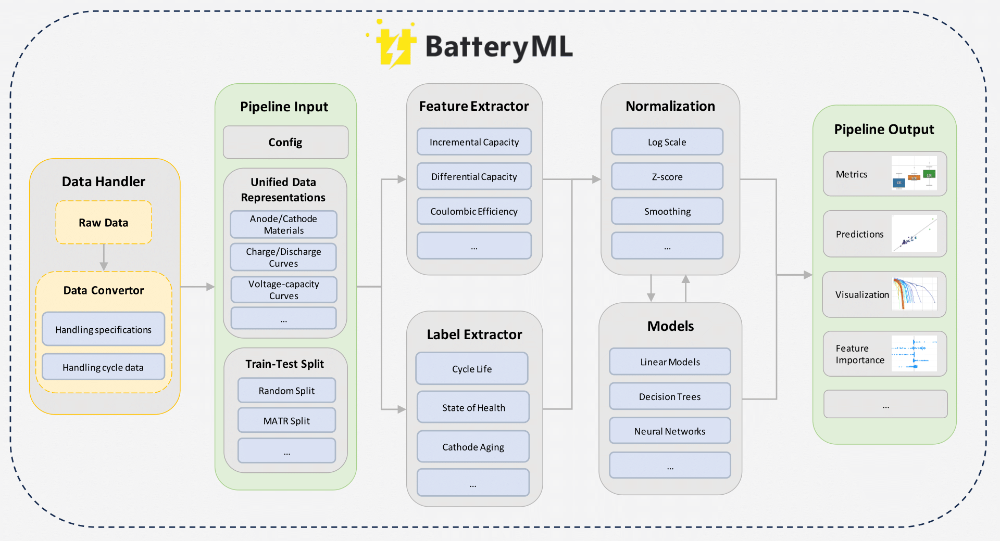
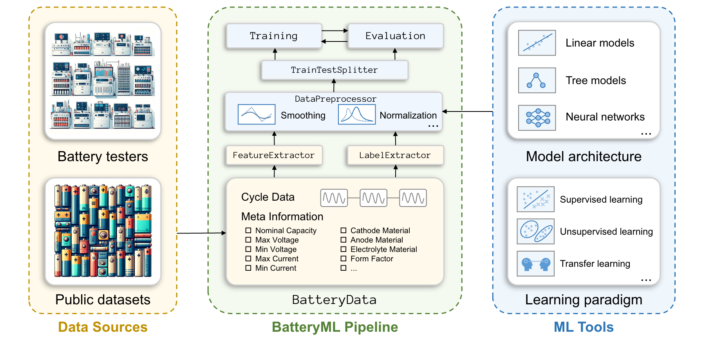

<div align="center">  
   
</div>  

# BatteryML: An Open-Source Tool for Machine Learning on Battery Degradation
## Recent News
Official code and data repository of BatteryML: An Open-Source Tool for Machine Learning on Battery Degradation (ICLR 2024). Please star, watch, and fork BatteryML for the active updates! We appreciate any questions and suggestions! 

Our paper is now available on [Arxiv](https://arxiv.org/abs/2310.14714) and [ICLR 2024](https://iclr.cc/virtual/2024/poster/17628)!  This paper provides detailed introduction to our design, which we will be actively updating during the development of BatteryML.

## Introduction

The performance degradation of lithium batteries is a complex electrochemical process, involving factors such as the growth of solid electrolyte interface, lithium precipitation, loss of active materials, etc. Furthermore, this inevitable performance degradation can have a significant impact on critical commercial scenarios, such as causing 'range anxiety' for electric vehicle users and affecting the power stability of energy storage systems. Therefore, effectively analyzing and predicting the performance degradation of lithium batteries to provide guidance for early prevention and intervention has become a crucial research topic.

To this end, we open source the BatteryML tool to facilitate the research and development of machine learning on battery degradation.
We hope BatteryML can empower both battery researchers and data scientists to gain deeper insights from battery degradation data and build more powerful models for accurate predictions and early interventions.

## Framework

<!--  -->



## Highlights:
- **Open-source and Community-driven:** BatteryML is an open-source project for battery degradation modeling, encouraging contributions and collaboration from the communities of both computer science and battery research to push the frontiers of this crucial field.
- **A Comprehensive Dataset Collection:** BatteryML includes a comprehensive dataset collection, allowing easy accesses to most publicly available battery data.
- **Preprocessing and Feature Engineering:** Our tool offers built-in data preprocessing and feature engineering capabilities, making it easier for researchers and developers to prepare ready-to-use battery datasets for machine learning.
- **A Wide Range of Models:** BatteryML already includes most classic models in the literature, enabling developers to quickly compare and benchmark different approaches.
- **Extensible and Customizable:** BatteryML provides flexible interfaces to support further extensions and customizations, making it a versatile tool for potential applications in battery research.

## Dataset
| Data Source | Electrode Chemistry | Nominal Capacity | Voltage Range (V) | RUL dist. | SOC dist. (%) | SOH dist. (%) | Cell Count |  
|---|---|---|---|---|---|---|---|  
| CALCE | LCO/graphite | 1.1 | 2.7-4.2 | 566±106 | 77±17 | 48±30 | 13 |  
| MATR | LFP/graphite | 1.1 | 2.0-3.6 | 823±368 | 93±7 | 36±36 | 180 |  
| HUST | LFP/graphite | 1.1 | 2.0-3.6 | 1899±389 | 100±10 | 43±28 | 77 |  
| HNEI | NMC_LCO/graphite | 2.8 | 3.0-4.3 | 248±15 | 64±17 | 49±28 | 14 |  
| RWTH | NMC/carbon | 1.11 | 3.5-3.9 | 658±64 | 60±24 | 46±22 | 48 |  
| SNL | NCA,NMC,LFP/graphite | 1.1 | 2.0-3.6 | 1256±1321 | 86±7 | 45±27 | 61 |  
| UL_PUR | NCA/graphite | 3.4 | 2.7-4.2 | 209±50 | 89±6 | 41±33 | 10 |  

For RUL (Remaining Useful Life) tasks, we also created combined datasets from the public sources to assess training efficacy when various battery data are combined. Notably:
- CRUH combines CALCE, RWTH, UL_PUR, and HNEI datasets
- CRUSH merges CALCE, RWTH, UL_PUR, SNL, and HNEI datasets
- MIX incorporates all datasets used in our study.

For more detailed information on the data, please refer to the Appendix A of our paper.


## Benchmark result of RUL(Remain Useful Life) task
Benchmark results for remaining useful life prediction. The comparison methods are split into four types, including 
1) dummy regressor, a trivial baseline that uses the mean of training label as predictions; 
2) linear models with features designed by domain experts; 
3) traditional statistical models with *QdLinear* feature; 
4) deep models with *QdLinear* feature. 

For models sensitive to initialization, we present the error mean across ten seeds and attach the standard deviation as subscript.  

| **Models**     | **MATR1** | **MATR2** | **HUST** | **SNL** | **CLO** | **CRUH** | **CRUSH** | **MIX** |  
|----------------|-----------|-----------|----------|---------|---------|----------|-----------|---------|  
| Dummy regressor|398        |510        |419       |466      |331      |239       |576        |573      |  
| "Variance" model|136       |211        |398       |360      |179      |118       |506        |521      |  
| "Discharge" model|329      |**149**    |**322**   |267      |143      |76        |>1000    |>1000  |  
| "Full" model   |167        |>1000    |335       |433      |**138**  |93        |>1000    |331      |  
| Ridge regression|116       |184        |>1000   |242      |169      |65        |>1000    |372      |  
| PCR            |**90**    |187        |435       |**200**  |197      |68        |560        |376      |  
| PLSR           |104        |181        |431       |242      |176      |**60**    |535        |383      |  
| Gaussian process|154       |224        |>1000   |251      |204      |115       |>1000    |573      |  
| XGBoost        |334        |799        |395       |547      |215      |119       |**330**    |205      |  
| Random forest  |168±9      |233±7      |368±7     |532±25   |192±2    |81±1      |416±5      |**197±0**|  
| MLP            |149±3      |275±27     |459±9     |370±81   |146±5    |103±4     |565±9      |451±42   |  
| CNN            |102±94     |228±104    |465±75    |924±267  |>1000  |174±92    |545±11     |272±101  |  
| LSTM           |119±11     |219±33     |443±29    |539±40   |222±12   |105±10    |519±39     |268±9    |  
| Transformer    |135±13     |364±25     |391±11    |424±23   |187±14   |81±8      |550±21     |271±16   |  
  


## Quick Start

### Install

```shell
pip install -r requirements.txt
pip install .
```

This will install the BatteryML into your Python environment, together with a convenient command line interface (CLI) `batteryml`.
You may also need to [install PyTorch](https://pytorch.org/get-started/locally/) for deep models.

### Download Raw Data and Run Preprocessing Scripts
<!-- Download the raw data and execute the preprocessing scripts as per the provided [instruction](./dataprepare.md). You can also use the code below to download public datasets and convert them to BatteryML's uniform data format. -->
Download raw files of public datasets and preprocess them into `BatteryData` of BatteryML is now as simple as two commands:

```bash
batteryml download MATR /path/to/save/raw/data
batteryml preprocess MATR /path/to/save/raw/data /path/to/save/processed/data
```

### Run training and/or inference tasks using config files

BatteryML supports using a simple config file to specify the training and inference process. We provided several examples in `configs`. For example, to reproduce the "variance" model for battery life prediction, run

```bash
batteryml run configs/baselines/sklearn/variance_model/matr_1.yaml ./workspace/test --train --eval
```


## Citation

If you find this work useful, we would appreciate citations to the following paper:
```
@inproceedings{zhang2024batteryml,
  title={Battery{ML}: An Open-source Platform for Machine Learning on Battery Degradation},
  author={Han Zhang and Xiaofan Gui and Shun Zheng and Ziheng Lu and Yuqi Li and Jiang Bian},
  booktitle={The Twelfth International Conference on Learning Representations},
  year={2024}
}
```

## Documentation

By leveraging BatteryML, researchers can gain valuable insights into the latest advancements in battery prediction and materials science, enabling them to conduct experiments efficiently and effectively. We invite you to join us in our journey to accelerate battery research and innovation by contributing to and utilizing BatteryML for your research endeavors.
